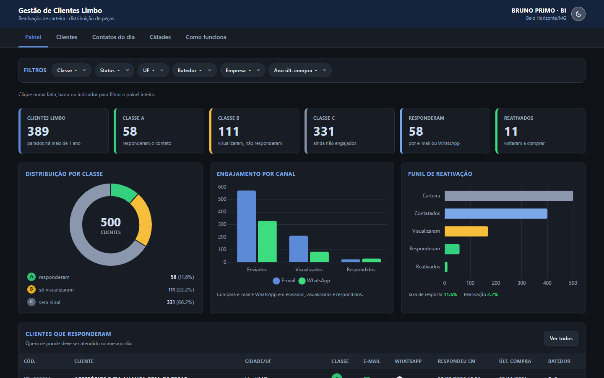
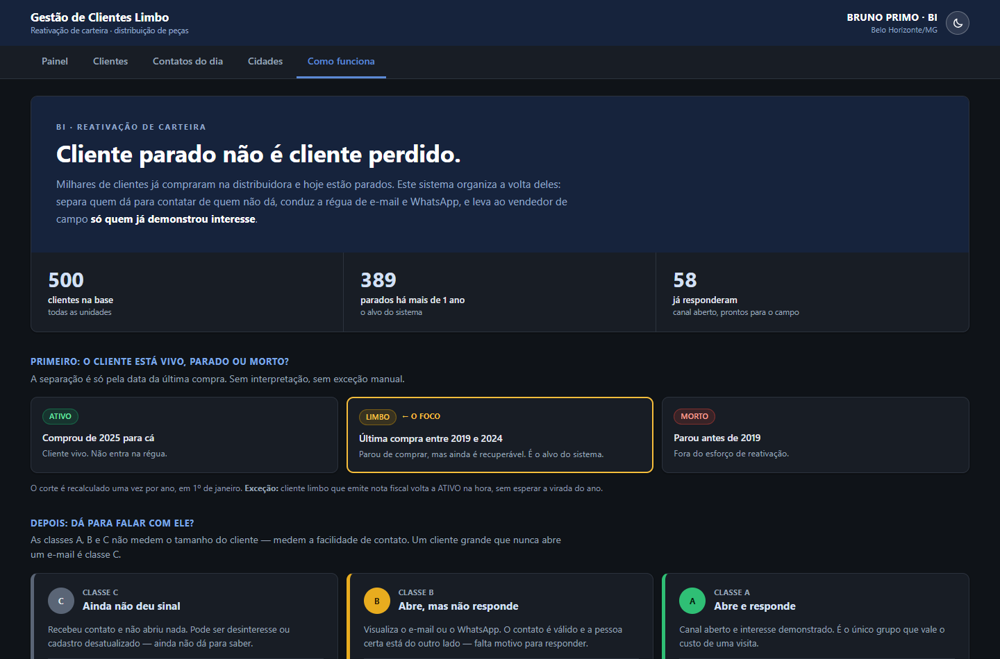
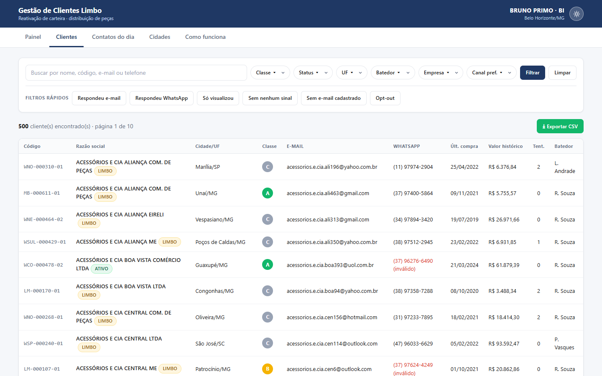
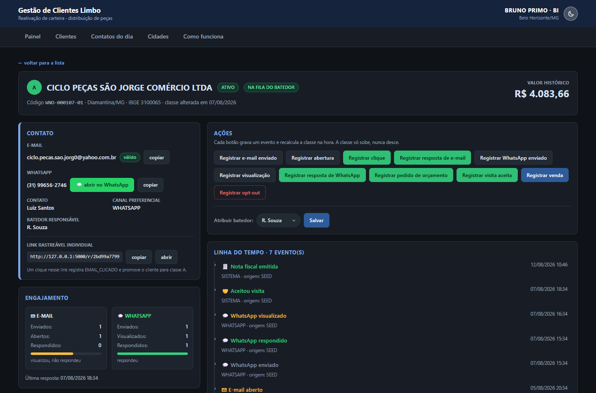
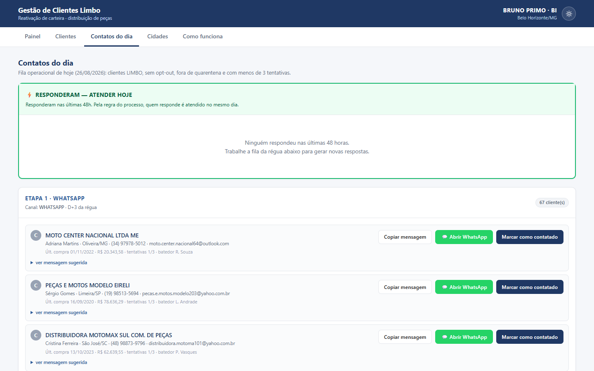

# Plataforma de Gestão de Clientes Limbo

> Cliente parado não é cliente perdido.

Sistema web para administrar a carteira de clientes que já compraram e hoje estão parados — os **clientes
limbo**. Classifica cada um pela facilidade de contato, conduz a régua de e-mail e WhatsApp, acompanha quem
respondeu e entrega ao vendedor de campo só quem já demonstrou interesse.




> **Projeto de demonstração.** Todos os clientes, e-mails, telefones, valores e eventos são fictícios,
> gerados por `seed.py`. Não há conexão com ERP nem com ferramenta real de e-mail ou WhatsApp.

---

## O problema

Uma distribuidora acumula, ao longo dos anos, milhares de clientes que compraram e pararam. A pergunta não é
*"quem são?"* — o ERP responde isso. É **por onde começar**: com 4.000 nomes numa planilha, o vendedor liga
para os primeiros da lista e desiste no terceiro dia.

Este sistema resolve isso invertendo o critério. Em vez de ordenar por faturamento ou por tempo de
inatividade, ele ordena por **facilidade de contato** — quem abre o e-mail, quem responde, quem some. Um
cliente grande que nunca abriu um e-mail vale menos esforço, hoje, do que um cliente médio que respondeu
ontem.

Três decisões sustentam isso:

| Decisão | Por quê |
|---|---|
| A classe **só sobe**, nunca desce | Quem respondeu uma vez provou que o canal funciona. Não se perde isso por ficar quieto. |
| Só **evento registrado** muda a classe | Nada sobe por opinião. Toda mudança tem data, canal e origem na linha do tempo. |
| Classe C **nunca** vai para o campo | Visita custa caro. Só vai para a rua quem já demonstrou interesse. |

---

## Como instalar e rodar

```bash
pip install -r requirements.txt
cd web && npm install && npm run build && cd ..
python app.py
# abra http://localhost:5000
```

Na primeira execução o `app.py` cria o arquivo `clientes_limbo.db`, monta o schema e popula 500 clientes,
120 municípios, ~1.340 eventos e 30 visitas. O seed é fixo (`random.seed(42)`): o resultado é sempre o mesmo.
Rodar de novo não duplica nada — se o banco já tem clientes, o seed é pulado.

Requisitos: Python 3.10 ou superior e Node 18 ou superior. O backend tem uma única dependência (`flask`);
o front traz React, Vite, Tailwind e Chart.js.

O `npm run build` só precisa ser repetido quando o código de `web/src` mudar. Se a pasta `web/dist` não
existir, o Flask responde com uma página explicando o que rodar, em vez de quebrar.

### Desenvolvendo o front

Com recarga automática, em dois terminais:

```bash
python app.py          # terminal 1 — API na porta 5000
cd web && npm run dev  # terminal 2 — Vite na porta 5173
# abra http://localhost:5173
```

O Vite encaminha `/api` para o Flask, então não há CORS a configurar. Em produção o Flask serve o build e
tudo fica na mesma origem, num processo só.

### Verificação automatizada

```bash
cd web && npm run verifica              # front do Vite (porta 5173)
cd web && npm run verifica -- http://127.0.0.1:5000   # build servido pelo Flask
```

Faz duas coisas. Primeiro abre as seis telas num Chrome headless e falha se alguma não renderizar, ficar com
texto invisível, estourar a largura da janela, deixar gráfico em branco ou soltar erro no console — nos temas
claro e escuro. Depois clica de verdade nos gráficos do painel e confere que o filtro entra na URL, que clicar
de novo remove e que o botão de drill-through leva a uma lista com exatamente o mesmo total que o gráfico
mostrava. Usa o Chrome já instalado (`puppeteer-core`), sem baixar navegador. É só leitura: não escreve no banco.

As imagens deste README saem de `node captura.mjs`, rodado dentro de `web/` com o Flask no ar — assim não
ficam desatualizadas quando a interface muda.

---

## As telas

**Painel (`/`)** — visão geral da carteira, e o BI do sistema. Seis filtros no topo (classe, status, UF,
batedor, empresa e ano da última compra), seis cartões de indicador, três gráficos e, no rodapé, a tabela dos
clientes que responderam ao contato.

**Tudo é clicável e tudo filtra o painel inteiro.** Clicar numa fatia da rosca, numa barra, num cartão de
indicador ou numa linha da legenda aplica o filtro; clicar de novo no mesmo ponto remove. Os seis indicadores,
os três gráficos e a tabela recalculam juntos, e o filtro entra na URL — então dá para mandar o link de uma
visão específica para outra pessoa. Uma faixa de chips mostra o que está filtrando no momento, com ✕ para
remover cada um, e um botão **ver os N clientes →** abre a lista já com o mesmo recorte.

Os três gráficos:

- **Distribuição por classe** — rosca com o total no centro. Clique numa fatia para filtrar por classe.
- **Engajamento por canal** — compara e-mail contra WhatsApp em enviados, visualizados e respondidos. Cada uma
  das seis barras filtra por aquele sinal específico (ex.: *respondeu por WhatsApp*).
- **Funil de reativação** — carteira → contatados → visualizaram → responderam → reativados, com a taxa de
  resposta e a taxa de reativação embaixo. É onde se vê em qual etapa a régua trava. Clique numa etapa para
  ver só os clientes que chegaram até ela.



**Clientes (`/clientes`)** — a listagem completa e navegável. Busca por nome, código, e-mail ou telefone;
filtros por classe, status, UF, batedor, empresa e canal preferencial; e seis filtros rápidos em destaque
(respondeu e-mail, respondeu WhatsApp, só visualizou, sem nenhum sinal, sem e-mail cadastrado e opt-out).
Colunas ordenáveis, paginação de 50 em 50 e exportação em CSV que respeita os filtros ativos.



**Ficha do cliente (`/cliente/<id>`)** — o coração do sistema. Reúne o bloco de contato (e-mail e WhatsApp com
botões de copiar e de abrir a conversa, mais o link rastreável individual), dois painéis de engajamento lado a
lado com os contadores de cada canal, o histórico comercial, a situação na régua, a linha do tempo com todos os
eventos e o bloco de ações. Cada botão de ação grava um evento e recalcula a classe na hora; quando o cliente
sobe de classe, um aviso verde informa a promoção. Fecha com o histórico de visitas e o formulário de retorno.



**Contatos do dia (`/regua`)** — a fila operacional: com quem falar hoje. No topo, fixa, a seção
"RESPONDERAM — ATENDER HOJE" com quem respondeu nas últimas 48 horas, porque quem responde é atendido no mesmo
dia. Abaixo, os clientes agrupados pela etapa da régua, cada grupo indicando o canal previsto. Para cada
cliente há o botão de copiar a mensagem já com as variáveis substituídas, o botão de abrir o WhatsApp com o
texto pronto e o botão de marcar como contatado, que grava o evento, conta a tentativa, avança a etapa e agenda
o próximo contato.



**Cidades (`/cidades`)** — o semáforo territorial. Resumo por cor no topo, grade de cartões com a borda na cor
da cidade, filtro por cor e por UF, e o selo "VIAGEM JUSTIFICADA" nas cidades com 5 ou mais clientes classe A.
As cidades brancas ficam em seção separada, rotuladas como território virgem para prospecção.

**Como funciona (`/como-funciona`)** — a tela de apresentação. Explica em uma página o que é um cliente limbo,
o que separam os status ATIVO/LIMBO/MORTO, o que significam as classes A/B/C, quais eventos movem um cliente de
classe, as seis etapas da régua, as seis regras que o código não deixa quebrar e o semáforo de cidades. Os três
números do topo vêm da API em tempo real, então o texto nunca descreve uma base que não é a que está no ar.
É por onde começar a mostrar o sistema para quem nunca viu.

**Catálogo rastreável (`/r/<token>`)** — o destino do link individual de cada cliente. Abrir o link registra o
evento `EMAIL_CLICADO`, promove o cliente para a classe A e mostra uma página de condição comercial com a
identidade visual da distribuidora. É o que transforma um clique em evidência registrada.

---

## Regras de negócio

### Status do cliente

| Status | Critério |
|---|---|
| ATIVO | Última compra a partir de 2025 |
| LIMBO | Última compra entre 2019 e 2024 |
| MORTO | Última compra anterior a 2019 |

O corte é recalculado uma vez por ano, em 1º de janeiro. **Exceção:** cliente LIMBO que emite nota fiscal volta
a ATIVO imediatamente.

### Classificação A / B / C — por facilidade de contato

| Classe | Comportamento | Significado |
|---|---|---|
| A | Visualiza os e-mails e responde | Canal aberto, já demonstrou interesse |
| B | Visualiza os e-mails, mas não responde | Contato válido, falta motivo para responder |
| C | Ainda não foi engajado | Sem sinal: desinteresse ou cadastro desatualizado |

Todo cliente começa como C. **A classe só sobe, nunca desce.** Nenhuma mudança acontece por opinião: sempre
precisa de um evento registrado. Não existe score, RFV, percentil ou recência — a classificação é só
engajamento, e a simplicidade é intencional.

### Eventos e seus efeitos

| Evento | Efeito |
|---|---|
| `EMAIL_ENVIADO` | Nenhum. Incrementa tentativas |
| `EMAIL_ABERTO` | C → B |
| `EMAIL_CLICADO` | → A |
| `EMAIL_RESPONDIDO` | → A |
| `EMAIL_DEVOLVIDO` | Marca o e-mail como inválido |
| `WHATSAPP_ENVIADO` | Nenhum. Incrementa tentativas |
| `WHATSAPP_VISUALIZADO` | C → B |
| `WHATSAPP_RESPONDIDO` | → A |
| `PEDIU_ORCAMENTO` | → A e entra na fila do batedor |
| `ACEITOU_VISITA` | → A e entra na fila do batedor |
| `NOTA_FISCAL` | Sai do LIMBO, vira ATIVO, marca a data de reativação |
| `OPT_OUT` | Sai da régua definitivamente |
| `TENTATIVA_SEM_RETORNO` | Incrementa tentativas |

### Régua de contato

| Etapa | Dia | Ação | Para quem |
|---|---|---|---|
| 0 | D+0 | E-mail de reaproximação | Todos |
| 1 | D+3 | WhatsApp | Quem virou B |
| 2 | D+10 | E-mail com oferta e prazo | Quem não respondeu |
| 3 | D+20 | WhatsApp de última chamada | Quem visualizou mas não respondeu |
| 4 | D+30 | Telefone | Classe A que parou de responder |
| 5 | D+45 | Encerra o ciclo | Quem não deu sinal |

Três tentativas sem nenhum sinal tiram o cliente da fila e o colocam 90 dias em quarentena. O opt-out é
definitivo. Quem responde é atendido no mesmo dia.

### Semáforo de cidades

| Cor | Critério |
|---|---|
| VERDE | Cidade com pelo menos 1 cliente ATIVO |
| AMARELA | Só clientes LIMBO |
| VERMELHA | Só clientes MORTOS |
| BRANCA | Nenhum cliente cadastrado — território virgem |

A cor branca só existe porque há uma tabela de municípios de referência: sem ela, cidade sem cliente jamais
apareceria em relatório algum.

### Fila do batedor

`PEDIU_ORCAMENTO` e `ACEITOU_VISITA` marcam o cliente como pronto para o campo (`na_fila_batedor`), e a ficha
mostra o selo correspondente. Cliente C nunca é entregue ao campo. O retorno da visita é registrado na própria
ficha: comprou, não comprou (com motivo) ou remarcado — e o resultado COMPROU reativa o cliente.

---

## Roteiro de demonstração

1. Abra o **Painel** e observe os seis indicadores e os três gráficos.
2. Vá em **Clientes** e clique no filtro rápido **Sem nenhum sinal** — são os classe C, ainda não engajados.
3. Escolha um cliente da lista e abra a **ficha**. Repare que a classe é C e o bloco de engajamento está zerado
   ou só com envios.
4. No bloco de contato, copie o **link rastreável individual**.
5. Cole o link em uma nova aba do navegador. Abre a página de catálogo com o aviso
   *"Clique registrado — cliente promovido para classe A"*.
6. Volte à ficha do cliente e recarregue: a pílula agora é **A**, o evento `EMAIL_CLICADO` com origem `LINK`
   aparece no topo da linha do tempo e o painel de e-mail registra a resposta.
7. Em **Contatos do dia**, veja o cliente aparecer no topo, na faixa *RESPONDERAM — ATENDER HOJE*: quem
   responde é atendido no mesmo dia.
8. Volte em **Clientes** e use **Exportar CSV** — o arquivo respeita os filtros ativos na tela.

---

## Estrutura do projeto

```
clientes-limbo/
├── app.py                 export CSV, link rastreável e entrega do build React
├── api.py                 API JSON em /api/* consumida pelo front
├── consultas.py           as consultas de cada tela, sem HTTP nem template
├── apresentacao.py        rótulos de evento e tradução de resultado em avisos
├── database.py            conexão SQLite e schema
├── regras.py              toda a lógica de negócio
├── seed.py                geração dos dados fictícios
├── web/                   front React (Vite + Tailwind)
│   ├── src/paginas/       uma tela por arquivo
│   ├── src/componentes/   pílula de classe, tag, filtros, gráfico, tema
│   ├── src/api.js         cliente HTTP
│   ├── src/formato.js     moeda e data em pt-BR
│   ├── verifica.mjs       verificação headless das telas
│   └── captura.mjs        regenera as imagens deste README
├── templates/catalogo.html  página pública do link rastreável (Jinja)
├── static/css/estilo.css  tokens de tema, usados pelo React e pelo catálogo
├── docs/                  capturas de tela usadas neste README
└── sql/                   o mesmo modelo em SQL Server, lendo o Protheus
```

O front é um SPA React; o Flask virou API. `consultas.py` existe para que a API e qualquer outro consumidor
leiam exatamente o mesmo SQL — manter as consultas em dois lugares faria os números divergirem em silêncio.

A página do link rastreável (`/r/<token>`) continua em Jinja de propósito: ela precisa abrir direto de um
clique no e-mail, sem depender de o bundle do React ter carregado.

O tema claro/escuro mora em `static/css/estilo.css` como tokens CSS. O React e o catálogo Jinja leem o mesmo
arquivo, então não existe cor duplicada entre os dois.

A lógica de negócio vive inteira em `regras.py`, fora das rotas. Três regras são invioláveis no código:

1. `aplicar_evento` é o único caminho que altera a classe de um cliente. Nenhuma rota mexe na classe direto.
2. A classe só sobe. Se o recálculo devolver uma classe menor que a atual, a atual é mantida.
3. Reclassificação usa UPSERT pela chave natural `(empresa, cod_cliente, loja)`. Cliente nunca é apagado e
   reinserido, porque o `id_cliente` é referenciado por eventos e visitas.

A pasta `sql/` é material de apoio: mostra como o modelo ficaria em produção lendo o Protheus/TOTVS —
`SA1010` para o cadastro, `SD2010` para o faturamento, `UNION ALL` entre as empresas, `RTRIM` nos campos CHAR,
datas em `CHAR(8)` no formato `YYYYMMDD`, filtro `D_E_L_E_T_ <> '*'` e a data `'19000101'` tratada como nula.
Esses scripts não são executados pela demonstração.

---

## Aviso

Projeto de demonstração. Todos os clientes, e-mails, telefones, valores e eventos são fictícios, gerados por
`seed.py`. O sistema **não está conectado ao ERP Protheus** nem a nenhuma ferramenta real de e-mail ou WhatsApp.

---

<p align="center">
  <a href="https://github.com/BrunoMP22">
    
  </a>
</p>
<p align="center">
  <sub>Desenvolvido por <b><a href="https://github.com/BrunoMP22">Bruno Primo</a></b></sub>
</p>
